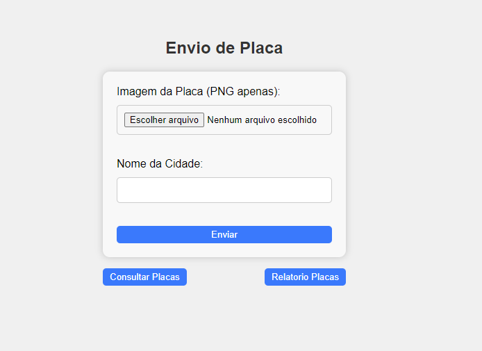
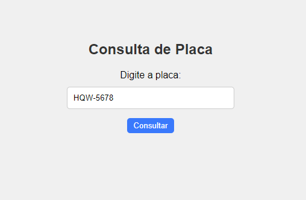

# PROJETO DE WEB 2

Este é o README para o projeto que envolve a criação de um sistema de reconhecimento de placas de veículos com o uso de Node.js, Express, MongoDB, e ReactJS. O projeto está dividido em duas partes: Backend e Frontend.

## Alunos:

- Francisco Luan
- Rafael Pereira
- Luan Claiver
- Luis Pedro

## Tecnologias Utilizadas:

### Backend:
- **Node.js:** Uma plataforma de desenvolvimento de aplicativos server-side baseada no motor JavaScript V8 do Google.
- **Express.js:** Um framework web para Node.js que facilita a criação de aplicativos web robustos.
- **MongoDB:** Um banco de dados NoSQL que armazena dados em formato JSON-like.
- **Tesseract OCR:** Uma biblioteca de reconhecimento de caracteres ópticos (OCR) para identificar placas em imagens.
- **Mongoose:** Uma biblioteca Node.js para modelar objetos MongoDB de forma mais simples e intuitiva.
- **GitHub:** Plataforma de controle de versão de código.
- Vercel: Plataforma de hospedagem para aplicativos web.

### Frontend:
- **ReactJS:** Uma biblioteca JavaScript para criar interfaces de usuário reutilizáveis e componentizadas.
- **Axios:** Uma biblioteca para fazer requisições HTTP.
- **Vercel:** Plataforma de hospedagem para aplicativos web.

## Divisão do Projeto:

O projeto foi dividido em duas partes: Backend e Frontend, cada uma com suas responsabilidades e funcionalidades.

### Backend:
O backend é responsável por gerenciar as rotas e a lógica de negócios do sistema. Ele oferece as seguintes funcionalidades:

A. **Cadastro de Placa**: 
   - Rota POST para '/cadastroPlaca'.
   - Recebe uma foto no formato PNG e o nome de uma cidade.
   - Utiliza uma API de OCR para reconhecer a placa na foto.
   - Armazena o número da placa, cidade, data e hora (gerado automaticamente) em um banco de dados MongoDB.

B. **Geração de Relatório**:
   - Rota GET para ‘/relatorio/cidade/:cidade’.
   - Gera um PDF para download com as informações de número da placa, cidade, data e hora dos registros com a cidade passada como parâmetro.

C. **Consulta de Placa**:
   - Rota GET para ‘/consulta/:placa’.
   - Retorna se uma placa está no banco de dados ou não.

O código do backend está versionado no GitHub e o servidor está executando no Vercel.

### Frontend:
O frontend é a interface de usuário que interage com o backend. Ele oferece as seguintes funcionalidades:

- **Cadastro de Placa**: Uma tela para cadastrar placas de veículos, onde o usuário pode enviar uma foto e o nome da cidade.

- **Geração de Relatório**: Uma tela para gerar relatórios com base na cidade escolhida.

- **Consulta de Placa**: Uma tela para verificar se uma placa está registrada no sistema.

## Imagens:

  

  

